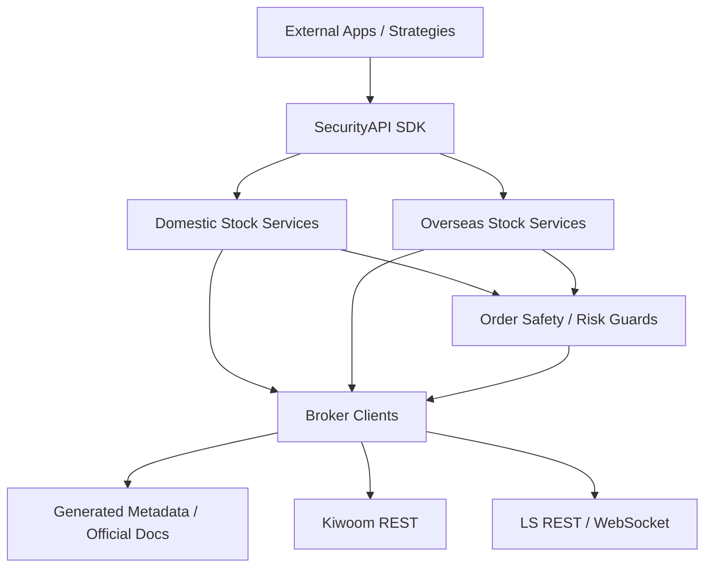

# Core Expansion Roadmap

이 문서는 SecurityAPI core를 실제 여러 앱에서 재사용 가능한 증권 API 래퍼로 확장하기 위한 범위와 순서를 정리한다.

현재 확장 범위는 국내주식과 해외주식까지만 둔다. 선물옵션, ELW, 신용, 공매도, 해외선물, 파생상품 전략 엔진은 이번 로드맵의 대상이 아니다.

## 1. 목표 범위

### 포함

- 국내주식 core 안정화 유지
- 해외주식 조회, 차트, 계좌, 주문, 실시간 레이어 추가
- 공식 문서 metadata와 실제 request builder의 명세 일치 검증
- 증권사별 차이를 감춘 단일 호출 경험 제공
- 원본 응답과 정규화 응답을 함께 제공
- 주문 안전장치 유지 및 해외주식 특화 안전장치 추가

### 제외

- 선물옵션/ELW/해외선물 등 파생상품 서비스화
- 자동매매 전략, 종목 추천, 매수/매도 판단
- 플랫폼 서버, UI 앱, 백테스트 엔진
- 실제 계좌를 이용한 live integration 실행
- 공식 문서에 없는 필드 의미 추측

## 2. 현재 상태

### Service-ready

현재 core는 국내주식 중심으로 다음 레이어가 서비스 형태로 구현되어 있다.

- 시세: 현재가, 호가, 복수 현재가
- 시장 데이터: 종목 기본 정보, 일/분봉
- 시장 맥락: 지수 현재가, 지수 차트, 예상지수
- 시장 수급: 투자자 순매수, 프로그램 매매
- 검색/조건: 거래량/거래대금/등락률 랭킹, 조건검색
- 계좌: 예수금, 잔고, 주문/체결 내역
- 주문: 신규, 정정, 취소, dry-run/live guard
- 실시간: 체결, 호가, 시장상태, 조건검색 이벤트
- 판단 입력: 가격/호가/시장상태/조건검색 이벤트를 strategy 입력으로 조립
- LS 해외주식: 현재가, 호가, 종목정보, 마스터, 차트, 시간대별 체결, 계좌, 주문, 실시간 체결/호가/주문 이벤트

### Metadata 또는 capability 수준

- LS 해외주식 현재가/호가/종목정보/마스터/차트/시간대별/계좌/주문/실시간 TR은 service-ready로 승격되었다.
- Kiwoom 해외주식은 현재 저장소의 공식 문서 metadata에 서비스화할 근거가 없다.
- 선물옵션 capability는 코드에 일부 존재하지만, 이번 로드맵에서는 service-ready 대상으로 승격하지 않는다.

## 3. 목표 아웃라인



외부 앱은 이 저장소의 SDK를 호출하고, 전략/화면/자동화 판단은 외부 앱에서 맡는다. SecurityAPI는 broker별 요청 형식, 인증, 연속조회, 실시간 envelope, 주문 안전장치, 응답 정규화까지만 책임진다.

## 4. 해외주식 확장 설계

상세 구현 계획은 [Overseas Stock Layer Plan](overseas-stock-layer-plan.md)을 기준으로 한다.

해외주식은 국내주식 service와 같은 모양을 유지하되, broker별 차이를 없애려고 필드 의미를 과하게 추상화하지 않는다. 공통 입력은 최소화하고, broker 원본 요청은 항상 확인 가능해야 한다.

### 공통 입력 모델

```ts
type OverseasStockIdentity = {
  broker: "ls";
  market?: string;
  exchange?: string;
  symbol: string;
  keySymbol?: string;
  currency?: string;
};
```

원칙:

- `symbol`은 앱이 다루는 표준 종목 코드로 둔다.
- `keySymbol`, `exchange`, `market`은 증권사 문서가 요구하는 경우 그대로 전달한다.
- 거래소/통화/시장 구분은 추측하지 않고 명시 입력 또는 안전한 default만 사용한다.
- Kiwoom은 공식 metadata가 확보되기 전까지 `UnsupportedCapabilityError`로 처리한다.

### 해외주식 서비스 후보

```text
src/services/OverseasStockQuoteService.mjs
src/services/OverseasStockMarketDataService.mjs
src/services/OverseasStockAccountService.mjs
src/services/OverseasStockOrderService.mjs
src/services/OverseasStockRealtimeService.mjs
```

각 서비스는 다음 원칙을 따른다.

- service method는 `broker`를 첫 인자로 받는다.
- 기본 구현은 LS만 지원한다.
- 원본 request body는 `normalized.request` 또는 dry-run 결과에서 확인 가능해야 한다.
- normalizer는 공통 필드와 원본 block을 함께 반환한다.
- 공식 manifest의 required request fields와 테스트로 대조한다.

## 5. 구현 단계

### M0. Scope 정리

목표:

- 이번 확장 범위를 국내주식 + 해외주식으로 고정한다.
- 선물옵션 capability는 service-ready가 아니라 metadata-only 또는 parked 상태로 구분한다.
- architecture 문서와 capability 테스트에서 “지원”과 “문서에 존재”의 의미를 분리한다.

완료 기준:

- 문서에서 선물옵션/파생상품이 이번 구현 범위 밖임을 명시한다.
- capability registry가 service-ready와 metadata-only 상태를 혼동하지 않는다.

### M1. 해외주식 quote 레이어

목표:

- LS 해외주식 현재가와 호가를 service-ready로 만든다.

우선 TR:

- `g3101`: 해외주식 현재가 조회
- `g3106`: 해외주식 현재가호가 조회

완료 기준:

- `getOverseasStockCurrentPrice("ls", input)` 구현
- `getOverseasStockOrderBook("ls", input)` 구현
- request builder가 manifest required field를 채운다.
- 정상 응답과 원본 응답을 모두 반환한다.
- Kiwoom 호출은 명확한 unsupported error를 반환한다.

### M2. 해외주식 market data 레이어

목표:

- 시장 판단에 필요한 해외주식 기초 데이터와 차트를 조회할 수 있게 한다.
- 현재 `g3104`, `g3190`, `g3103`, `g3204`, `g3102`는 service-ready 상태다.

우선 TR:

- `g3104`: 해외주식 종목정보 조회
- `g3190`: 해외주식 마스터 조회
- `g3103`: 해외주식 일주월 조회
- `g3204`: 해외주식 일주월년별 조회
- `g3102` 또는 `g3202`: 시간/틱 계열 조회

완료 기준:

- 종목 기본 정보 normalizer 추가
- 일/주/월/년 candle normalizer 추가
- 차트 조회는 interval/date range 입력 규칙을 문서화한다.

### M3. 해외주식 account 레이어

목표:

- 해외주식 잔고, 예수금, 주문/체결 내역을 앱에서 조회할 수 있게 한다.
- 현재 `COSOQ00201`, `COSOQ02701`, `COSAQ00102`, `COSAQ01400`은 service-ready 상태다.

우선 TR:

- `COSOQ00201`: 해외주식 종합잔고평가
- `COSOQ02701`: 해외주식 예수금 조회
- `COSAQ00102`: 해외주식 계좌주문체결내역조회
- `COSAQ01400`: 예약주문 처리결과 조회

완료 기준:

- 잔고 normalizer가 종목, 수량, 평가금액, 손익, 통화를 포함한다.
- 예수금 normalizer가 통화별 금액을 보존한다.
- 주문/체결 내역은 주문번호, 상태, 체결수량, 미체결수량을 포함한다.

### M4. 해외주식 order 레이어

목표:

- 해외주식 신규, 정정, 취소 주문을 국내주식 주문과 같은 안전장치 아래에서 제공한다.
- 현재 `COSAT00301`, `COSAT00311`, `COSAT00400`은 service-ready 상태다.

우선 TR:

- `COSAT00301`: 미국시장주문
- `COSAT00311`: 미국시장주문정정
- `COSAT00400`: 해외주식 예약주문 등록 및 취소

보류 TR:

- `COSMT00300`: 서비스-ready 의미와 안전장치가 정리될 때까지 별도 검토

완료 기준:

- dry-run 기본값 유지
- live 주문은 `confirm: true` 필수
- 시장가 주문은 `confirmMarketOrder: true` 필수
- 주문 retry는 기본 금지
- `expectedRequest` mismatch 시 live 주문 차단
- 통화, 거래소, 주문가능 시간, 수량/금액 sanity check 추가

### M5. 해외주식 realtime 레이어

목표:

- 해외주식 실시간 시세와 주문 이벤트를 국내주식 realtime과 같은 구독 모델로 제공한다.

우선 TR:

- `GSC`: 해외주식 체결
- `GSH`: 해외주식 호가
- `AS0`: 주문접수
- `AS1`: 주문체결
- `AS2`: 주문정정
- `AS3`: 주문취소
- `AS4`: 주문거부

완료 기준:

- subscribe/unsubscribe envelope 테스트 추가
- 체결/호가/주문 이벤트 normalizer 추가
- 기존 `WebSocketBrokerClient`의 reconnect 후 resubscribe 동작을 유지한다.

### M6. 감사와 예제

목표:

- 해외주식 service-ready 범위 전체를 공식 metadata와 대조한다.

완료 기준:

- `test/audit/coreSpecAudit.test.mjs`가 해외주식 서비스를 포함한다.
- request builder의 필수 필드가 manifest와 일치한다.
- 대표 응답 normalizer 테스트가 있다.
- `docs/audits/`에 해외주식 확장 감사 문서를 추가한다.
- `npm run validate:all`이 통과한다.

## 6. 증권사별 차이 처리 원칙

- broker별 차이는 adapter/service 내부에서 처리한다.
- 공통 모델은 앱이 여러 증권사를 바꿔 끼울 수 있을 정도까지만 맞춘다.
- 공통 모델로 설명되지 않는 broker 원본 필드는 `raw`와 `blocks`에 보존한다.
- 지원하지 않는 broker/capability는 silent fallback 없이 명확히 실패한다.
- API 문서에 존재하는 것과 service-ready 지원은 별도 상태로 표현한다.

## 7. 품질 기준

각 해외주식 기능은 다음을 만족해야 service-ready로 본다.

- 공식 manifest의 TR/API ID와 연결되어 있다.
- request builder가 필수 필드를 모두 채운다.
- 대표 response normalizer가 있다.
- unsupported broker 테스트가 있다.
- dry-run 또는 mock fetch로 네트워크 없이 테스트할 수 있다.
- 원본 응답과 정규화 응답이 함께 반환된다.
- 주문 기능은 safety guard 테스트를 포함한다.

## 8. 다음 작업

1. 해외주식 확장 감사 문서를 최신 구현 범위로 갱신한다.
2. `npm run validate:all`로 전체 문서/manifest/test/example을 다시 확인한다.
3. 이후 범위는 해외주식 live integration 체크리스트와 예제 보강으로 분리한다.
