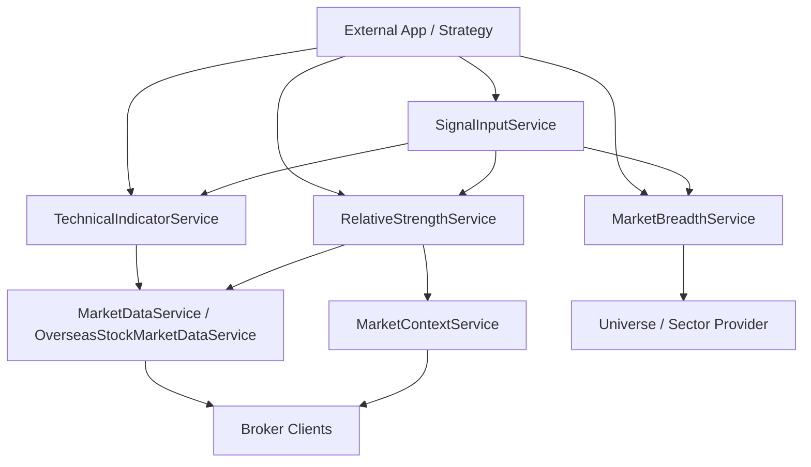

# Technical Indicators And Market Signals Design

Last updated: 2026-05-23

이 문서는 SecurityAPI SDK가 기술적 지표, 상대강도, 시장 폭, 캔들 패턴을 외부 서버/앱에서 활용하기 좋은 형태로 제공하기 위한 설계 기준을 정리한다.

목표는 매수/매도 결론을 내리는 전략 엔진이 아니라, 전략 앱이 판단에 사용할 수 있는 정량 입력값을 안정적으로 만드는 것이다.

## 1. 설계 원칙

- 지표 계산은 broker와 분리한다. broker client는 캔들을 가져오고, indicator layer는 표준 OHLCV만 읽는다.
- 숫자 기준은 하드코딩하지 않는다. 기본값은 제공하되 모든 기간, 배수, 임계값은 profile/options로 바꿀 수 있어야 한다.
- 단일 종목 캔들로 계산 가능한 지표와 시장 전체 유니버스가 필요한 지표를 분리한다.
- 정량 플래그는 제공할 수 있지만 매수/매도 추천 문구는 제공하지 않는다.
- 결과는 `latest` 요약과 전체 시계열을 함께 제공한다.
- 원본 캔들, source API/TR, profile snapshot을 보존해 재현 가능하게 한다.

## 2. 요구사항 재분류

### A. 단일 캔들 기반 지표

입력은 한 종목 또는 한 지수의 OHLCV 배열이다. `TechnicalIndicatorService`의 책임으로 둔다.

| 영역 | 지표 | 기본값 | 출력 |
| --- | --- | --- | --- |
| 추세 | SMA | `[5, 20, 60, 120, 200]` | 기간별 이동평균 시계열, 최신값 |
| 추세 | EMA | `[12, 26]` | 기간별 지수이동평균 시계열 |
| 추세 | Disparity | `[20, 60]` | `close / MA * 100` |
| 추세 | MA alignment | `[5, 20, 60, 120]` | 정배열/역배열/혼조 |
| 추세 | MA slope | periods `[20, 60]`, lookback `5` | 5봉 전 대비 이동평균 변화율 |
| 모멘텀 | RSI | `14` | RSI 시계열, 과열/침체 플래그용 값 |
| 모멘텀 | MACD | `12, 26, 9` | line, signal, histogram, 교차 상태 |
| 모멘텀 | Stochastic | `14, 3, 3` | `%K`, slow `%K`, `%D` |
| 거래량 | Volume MA | `[20]` | 평균 거래량 |
| 거래량 | Volume ratio | `20` | 현재 거래량 / 평균 거래량 |
| 거래량 | Value ratio | `20` | 현재 거래대금 / 평균 거래대금 |
| 거래량 | OBV | - | 누적 OBV, 가격 다이버전스 계산 입력 |
| 거래량 | MFI | `14` | 거래량 가중 RSI |
| 변동성 | ATR | `14` | 평균 진폭, 동적 손절 입력값 |
| 변동성 | Bollinger Bands | `20, 2` | middle, upper, lower, bandwidth |
| 변동성 | Standard deviation | `20` | 종가 표준편차 |
| 캔들 | Candle color/pattern | profile 기반 | 양봉/음봉, 장대봉, 도지, 망치형 등 |

주의할 점:

- 거래량 비율과 거래대금 비율은 분리한다. 요구사항의 “당일 거래대금 / 20일 평균”은 `valueRatio`로 둔다.
- 추세선 기울기는 절대 가격 변화보다 `((MA now / MA lookback) - 1) * 100` 형태의 퍼센트 slope를 기본으로 둔다.
- MACD 교차, RSI 과열 같은 판단은 `flags`로 제공하되 주문 판단으로 해석하지 않는다.

### B. 비교 캔들 기반 지표

입력은 대상 캔들과 비교 기준 캔들이다. `RelativeStrengthService`의 책임으로 둔다.

| 지표 | 필요 데이터 | 기본값 | 출력 |
| --- | --- | --- | --- |
| RS vs KOSPI | 종목 캔들 + KOSPI 캔들 | `periods: [20, 60]` | 수익률 차이, 수익률 비율, 추세 |
| RS vs sector | 종목 캔들 + 섹터 지수 캔들 | `periods: [20, 60]` | 섹터 대비 상대강도 |
| Sector RS vs KOSPI | 섹터 지수 캔들 + KOSPI 캔들 | `periods: [20, 60]` | 섹터 자금 선호도 입력 |

주의할 점:

- `종목 수익률 / KOSPI 수익률`은 benchmark 수익률이 0에 가까울 때 왜곡된다. 따라서 `ratio`와 `spread`를 둘 다 제공한다.
- 섹터 RS는 종목-섹터 매핑이 필요하다. 이 매핑은 SDK 내부에서 추측하지 않고 앱이 제공하거나 별도 universe/sector provider에서 주입한다.
- 섹터 지수 캔들이 없으면 앱이 `basketSymbols` 또는 `basketCandlesBySymbol`을 제공해 동일가중 섹터 basket benchmark를 만들 수 있다. 입력 명세는 [Market Signal Input Contract](market-signal-input-contract.md)를 따른다.

### C. 시장 전체 유니버스 기반 지표

입력은 시장 전체 종목 목록과 종목별 상태 또는 캔들이다. `MarketBreadthService`의 책임으로 둔다.

| 지표 | 필요 데이터 | 출력 |
| --- | --- | --- |
| ADL | 상승 종목 수, 하락 종목 수의 일별 배열 | AD line, divergence 입력 |
| 신고가/신저가 비율 | 시장 전체 종목의 52주 고저가 상태 | highLowRatio, newHighCount, newLowCount |
| 20일선 위 종목 비율 | 시장 전체 종목별 종가/SMA20 | aboveMaRatio, count, universeSize |

주의할 점:

- 이 영역은 API 호출량이 커진다. 실시간 호출보다 캐시, 배치, 일별 스냅샷이 우선이다.
- 52주는 보통 252거래일 기준으로 계산한다. 기간은 profile에서 바꿀 수 있어야 한다.
- 개별 종목 SDK 호출 루프를 기본 제공하지 않는다. 호출 비용이 큰 기능은 `universeProvider`를 주입받아 계산한다.

## 3. 레이어 설계



### TechnicalIndicatorService

책임:

- 단일 OHLCV 배열 기반 지표 계산
- 국내주식/해외주식 캔들 조회 후 지표 계산
- 지표 profile 기본값과 override 병합
- 최신 snapshot, 시계열, flags 생성

대표 API:

```js
technical.calculateFromCandles(candles, profile);

technical.getDomesticStockIndicators("kiwoom", "005930", profile);

technical.getOverseasStockIndicators("ls", {
  symbol: "TSLA",
  exchangeCode: "82",
}, profile);

technical.getUsStockIndicators("db", {
  symbol: "TSLA",
  exchangeCode: "NASDAQ",
}, profile);
```

미국주식 래퍼는 `countryCode: "US"`와 `currencyCode: "USD"`를 기본값으로 채우고, broker별 해외주식 캔들 API로 OHLCV를 조회한 뒤 같은 계산기를 사용한다. `latest` 외에 `summary.movingAverageRating`, `summary.oscillatorRating`, `summary.technicalRating`을 `strongPositive | positive | neutral | negative | strongNegative` 중 하나로 제공하지만, 매수/매도 결론 필드는 만들지 않는다.

### RelativeStrengthService

책임:

- 대상 캔들과 benchmark 캔들의 기간별 상대강도 계산
- KOSPI, KOSDAQ, 섹터 지수 대비 비교값 제공
- benchmark 조회는 명시 입력 또는 provider 주입으로만 수행

대표 API:

```js
relativeStrength.calculateRelativeStrength({
  targetCandles,
  benchmarkCandles,
  periods: [20, 60],
});

relativeStrength.getDomesticStockRelativeStrength("kiwoom", "005930", {
  benchmark: { type: "index", code: "kospi" },
  periods: [20, 60],
});

relativeStrength.getDomesticStockRelativeStrengthVsBasket("kiwoom", "005930", {
  basketCode: "semiconductor",
  basketSymbols: ["000660", "042700", "039030"],
  periods: [20, 60],
});

relativeStrength.getUsStockRelativeStrength("kis", {
  symbol: "TSLA",
  exchangeCode: "NASDAQ",
}, {
  benchmarkIdentity: { symbol: "SPY", exchangeCode: "AMEX" },
  periods: [20, 60],
});
```

미국주식 상대강도는 계산형 v1이다. 앱이 `benchmarkCandles`를 직접 넘기거나 `benchmarkIdentity`를 지정하면 같은 `OverseasStockMarketDataService` 캔들 경로로 비교 대상을 조회한다. 기본 자동 벤치마크는 `SPY`이며, `QQQ`, `IWM`, sector ETF는 옵션으로 명시한다.

### MarketBreadthService

책임:

- 시장 전체 폭 지표 계산
- universe snapshot 기반 ADL, 신고가/신저가 비율, MA 상회 비율 생성
- 호출량이 큰 live 수집은 직접 수행하지 않고 provider 인터페이스를 우선한다.

대표 API:

```js
breadth.calculateAdvanceDeclineLine(rows);

breadth.calculateHighLowRatio(rows, {
  lookback: 252,
});

breadth.calculateAboveMovingAverageRatio(candlesBySymbol, {
  period: 20,
});
```

미국시장 시장폭도 동일하게 provider 주입만 지원한다. 브로커 API로 전체 universe를 순회하지 않고, 앱이 `advanceDeclineRows`, `highLowRows`, `candlesBySymbol` 같은 snapshot 입력을 제공하면 기존 계산기를 재사용한다.

### SignalInputService 통합

SignalInputService는 전략 판단 전 단계의 종합 입력값을 만든다.

추가 옵션:

```js
signals.getDomesticStockSignalInputs("ls", "005930", {
  includeTechnicalIndicators: true,
  includeRelativeStrength: true,
  includeMarketBreadth: false,
  indicatorProfile: "eraCore",
});
```

원칙:

- `signals`에는 과열, 정배열, 거래대금 급증 같은 플래그를 넣을 수 있다.
- `decision`, `recommendation`, `buy`, `sell` 같은 결론 필드는 넣지 않는다.
- 시장 폭처럼 비용 큰 입력은 기본 off로 둔다.

## 4. Profile 설계

숫자 기준은 profile로 관리한다. 기본 profile은 요구사항의 값을 반영하되, 외부 앱이 언제든 덮어쓸 수 있어야 한다.

```js
export const DEFAULT_TECHNICAL_PROFILE = {
  trend: {
    smaPeriods: [5, 20, 60, 120, 200],
    emaPeriods: [12, 26],
    disparityPeriods: [20, 60],
    maAlignmentPeriods: [5, 20, 60, 120],
    slope: {
      periods: [20, 60],
      lookback: 5,
    },
  },
  momentum: {
    rsiPeriod: 14,
    macd: {
      fastPeriod: 12,
      slowPeriod: 26,
      signalPeriod: 9,
    },
    stochastic: {
      kPeriod: 14,
      kSmoothing: 3,
      dPeriod: 3,
    },
  },
  volume: {
    movingAveragePeriods: [20],
    ratioPeriod: 20,
    valueRatioPeriod: 20,
    mfiPeriod: 14,
  },
  volatility: {
    atrPeriod: 14,
    bollingerBands: {
      period: 20,
      standardDeviations: 2,
    },
    standardDeviationPeriod: 20,
  },
  relativeStrength: {
    periods: [20, 60],
  },
  breadth: {
    maPeriod: 20,
    highLowLookback: 252,
  },
  thresholds: {
    overheatedDisparity20: 115,
    rsiOverbought: 70,
    rsiOversold: 30,
    earlyTrendVolumeRatio: 1.5,
    alertValueRatio: 3,
    atrStopMultiplier: 1.5,
    longBodyBodyToRangeRatio: 0.7,
    dojiBodyToRangeRatio: 0.1,
  },
};
```

Profile 사용 원칙:

- 계산 기간과 알림 임계값을 분리한다.
- `thresholds`는 flag 생성을 위한 기준일 뿐, 주문 실행 조건이 아니다.
- 외부 앱은 profile 객체를 직접 전달하거나 이름 있는 preset을 등록할 수 있다.

## 5. 응답 모델

지표 응답은 외부 앱이 바로 저장, 비교, 알림 처리할 수 있게 같은 모양을 유지한다.

```ts
type TechnicalIndicatorSnapshot = {
  broker: "kiwoom" | "ls" | null;
  symbol: string | null;
  interval: string | null;
  profile: object;
  candles: Candle[];
  indicators: {
    trend: object;
    momentum: object;
    volume: object;
    volatility: object;
    candlePatterns: object;
  };
  latest: {
    candle: Candle;
    trend: object;
    momentum: object;
    volume: object;
    volatility: object;
    candlePatterns: object;
    flags: object;
  } | null;
  source: object | null;
  meta: {
    inputCount: number;
    outputCount: number;
    requiredWarmup: number;
  };
};
```

Flags 예시:

```js
{
  maAlignment: "bullish",
  disparity20Overheated: true,
  rsiZone: "overbought",
  macdCross: "golden",
  volumeRatioAboveEarlyTrend: true,
  valueRatioAlert: false,
  candleColor: "bullish",
}
```

## 6. 구현 순서

현재 구현 상태: T1~T5의 국내주식 계산 레이어는 구현 완료이며, 미국주식은 LS/DB/KIS 해외주식 캔들 기반 `getUsStockIndicators()`와 `getUsStockRelativeStrength()`까지 구현되어 있다. Kiwoom 미국주식은 공식 manifest에 캔들 API가 없으므로 service 호출 시 unsupported로 남긴다.

### T1. TechnicalIndicatorService 확장

목표:

- 단일 캔들 기반 지표를 전부 계산 가능하게 한다.

추가:

- Disparity
- MA alignment
- MA slope
- Stochastic
- Volume ratio / Value ratio
- OBV
- MFI
- ATR
- Standard deviation
- Candle color/pattern
- profile merge와 flags

완료 기준:

- 모든 계산 함수가 독립 export 된다.
- 모든 숫자 기준이 options/profile로 바뀐다.
- 기존 `calculateFromCandles`와 `getDomesticStockIndicators`가 새 출력 구조를 반환한다.
- `npm run validate:all` 통과.

### T2. RelativeStrengthService 추가

목표:

- 종목/섹터/지수 간 상대강도를 재사용 가능한 계산값으로 제공한다.

완료 기준:

- `calculateRelativeStrength` pure function 구현.
- `getDomesticStockRelativeStrength` 구현.
- KOSPI/KOSDAQ benchmark 조회는 명시 입력을 사용한다.
- benchmark 수익률 0 근처 처리 테스트 포함.

### T3. MarketBreadthService 추가

목표:

- 시장 폭 지표의 계산 모델과 provider 계약을 만든다.

완료 기준:

- ADL, high/low ratio, above MA ratio pure function 구현.
- live 전체시장 수집은 provider 인터페이스만 정의한다.
- 외부 앱이 캐시된 universe snapshot을 넣어 계산할 수 있다.

### T4. SignalInputService 통합

목표:

- 외부 전략 앱이 한 번에 읽을 수 있는 판단 입력 snapshot에 지표를 포함한다.

완료 기준:

- `includeTechnicalIndicators`, `includeRelativeStrength`, `includeMarketBreadth` 옵션 추가.
- 기본값은 비용이 낮은 technical indicators만 optional.
- 결과에 `metrics.technical`, `signals.technical`, `metrics.relativeStrength`, `metrics.breadth` 추가.
- 매수/매도 결론 필드는 추가하지 않는다.

### T5. 문서/예제/검증

목표:

- 외부 앱이 Git dependency로 설치 후 지표를 바로 계산할 수 있게 한다.

완료 기준:

- SDK Usage Guide에 technical/relative/breadth 예제 추가.
- Public SDK Contract에 신규 서비스와 응답 안정성 명시.
- mock example에 indicator snapshot 확인 추가.
- `npm run validate:all`, `npm pack --dry-run` 통과.

## 7. 보류 또는 별도 결정 사항

- 종목-섹터 매핑의 공식 기준: broker 문서만으로 부족하면 외부 앱 또는 별도 데이터 provider가 책임진다.
- 시장 전체 universe 수집: API 호출량과 rate limit을 고려해 SDK 기본 기능이 아니라 provider/cached snapshot 기반으로 시작한다.
- 캔들 패턴의 민감도: 장대봉, 도지, 망치형 기준은 profile threshold로만 제공한다.
- 월봉/주봉/일봉 동시 추세 판정: 개별 indicator 계산은 가능하지만 멀티 타임프레임 종합 점수는 전략 앱 또는 SignalInput 옵션으로 분리한다.
- “봉인 종목”, “트랙 2 알림” 같은 앱 고유 용어는 SDK core에는 넣지 않고, profile 이름이나 외부 앱 규칙으로 관리한다.

## 8. 최종 구조

```text
SecurityAPI SDK
  TechnicalIndicatorService
    - one symbol/index OHLCV indicators
    - domestic/overseas/US stock wrappers
    - configurable periods and thresholds
    - latest snapshot, summary ratings, and series

  RelativeStrengthService
    - target vs benchmark
    - stock vs KOSPI
    - stock vs sector
    - sector vs KOSPI
    - US stock vs ETF benchmark

  MarketBreadthService
    - market universe health
    - ADL
    - high/low ratio
    - above MA ratio

  SignalInputService
    - optional composition layer
    - aggregates quote, candles, technicals, RS, breadth
    - no buy/sell recommendation
```

이 구조를 따르면 지표 계산은 SDK에서 재사용하고, 전략 판단과 알림 조건은 외부 앱에서 바꿔 끼울 수 있다.
